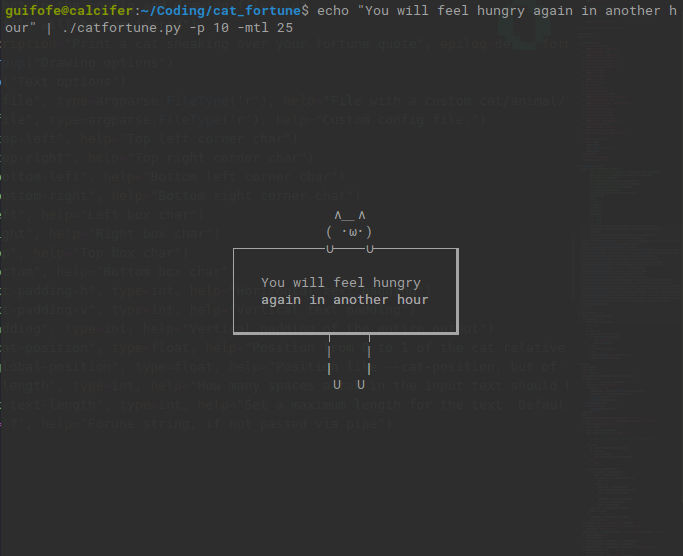
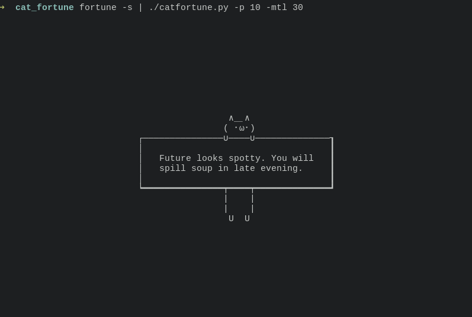
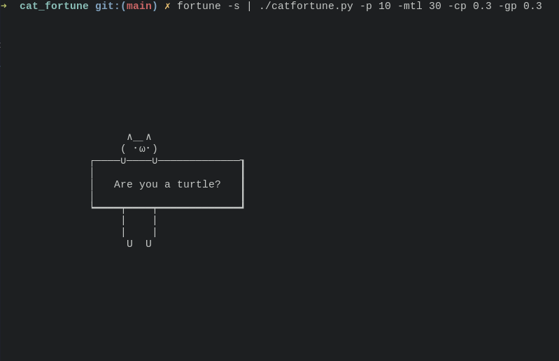

# Fortune Cat

Like the cow, but it's a cat (and has many more options). You can change the animal in a config file (to specify with -c) or with a dedicated file (-d).  
  
Take a look [here](https://github.com/GuidoFe/bashCatWithKitten) if you would like to have a cat to decor your `cat` command.
## Requirements

Python 3.0+, necessary for a simpler unicode manipulation.

## Examples





## How to use

Be sure to have Python3 and to make the script executable (`chmod +x ./catfortune.py`)

You can use it
* With a pipe: `fortune | ./catfortune.py [OPTIONS]`
* With a string: `./catfortune.py [OPTIONS] "Hello"`

## Options

Usage: catfortune.py OPTIONS [text]

You can rename the file and/or remove the extension if you want

### File Options

| Command                 | Description                                  |
|-------------------------|----------------------------------------------|
| -d, --drawing-file FILE | File with a custom cat/animal/thinghy        |
| -c, --config-file FILE  | Custom config file.                          |

### Drawing Options

| Command                     | Description                                                                                                  |
|-----------------------------|--------------------------------------------------------------------------------------------------------------|
| `-tl, --top-left STR`       | Top left corner character                                                                                    |
| `-tr, --top-right STR`      | Top right corner char                                                                                        |
| `-bl, --bottom-left STR`    | Bottom left corner char                                                                                      |
| `-br, --bottom-right STR`   | Bottom right corner char                                                                                     |
| `-l, --left STR`            | Left box char                                                                                                |
| `-r, --right STR`           | Right box char                                                                                               |
| `-t, --top STR`             | Top box char                                                                                                 |
| `-b, --bottom STR`          | Bottom box char                                                                                              |
| `-p, --padding INT`         | Vertical padding of the entire output                                                                        |
| `-cp, --cat-position FLOAT` | Position from 0 to 1 of the cat relative to the box. 0 = all to the left, 1 = all to the right, 0.5 = center |  
| `-gp, --global-position INT`| Position like --cat-position, but of the entire output relative to the terminal   

### Text Options

| Command                       | Description                                                                                    |
|-------------------------------|------------------------------------------------------------------------------------------------|
| `-tph, --text-padding-h INT`  | Horizontal text padding                                                                        |
| `-tpv, --text-padding-v INT`  | Vertical text padding                                                                          |
| `-tb, --tab-length INT`       | How many spaces a tab in the input text should be. Default = 2                                 |
| `-mtl, --max-text-length INT` | Set a maximum length for the text. Default is 0, that means it will only adapt to the terminal |
                        
### Other

| Command           | Description                   |
|-------------------|-------------------------------|
| `-h, --help`      | Print a guide to the script   |

### Visual Guide

```
                                                     ━┒
                                                      ┃ -p
              ∧＿∧                                    ┃
             ( ･ω･)          -t=─                    ━┛
    -tl=┌────∪────∪───────────── ──────────┒=-tr    ━┒ 
        │                                  ┃         ┃ -tpv
     -l=│   You have an ability to sense   ┃        ━┛
        │   and know higher truth.         ┃
        │                                r=┃
    -bl=┕━━━━┯━━━━┯━━━━━━━━━━━━━ ━━━━━━━━━━┛=-br
             |    |          -b=━
             |    |
              U  U
                                       ┕━━┛=-tph
                                        
```

## Configuration files

### Drawing file

It's the file where you can create a custom cat. Specify its path with the option `-d`.  

- The first line must be the number of characters of the longest line of the drawing.
- The orher lines are those of the drawing. **There must be `OUTPUT` as one of the lines**: it separates the top and the bottom part of the ASCII art.

Example:

```
8
  ∧＿∧
 ( ･ω･)
─∪────∪─
OUTPUT
━┯━━━━┯━
 |    |
 |    |
  U  U
```

### Config File

Specify its path with `-c`. It contains the same arguments as the command line options. You must specify them in a single line.  
You can optionally specify a custom drawing after the first line, with the same format as the drawing file. The latter will have precedence over the ASCII art in the config file.

Example:
```
-tl ┌ -tph 3 -tpv 5 -l |
8
  ∧＿∧
 ( -.-)
─∪────∪─
OUTPUT
━┯━━━━┯━
 |    |
 |    |
  U  U
```
